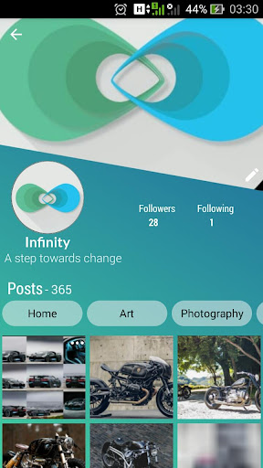
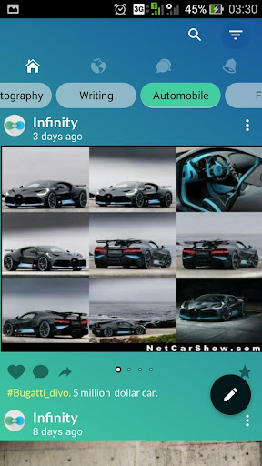
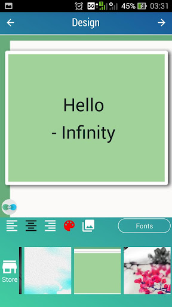
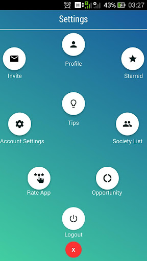

# Infinity Social Media (2018-19)
A fully functional social media app developed using Android Java. Here users are segregated using societies for writing, photography, automobiles, etc. for like-minded people.

# Technologies
- Android Java
- Node.js (Backend)
- MongoDB (Database)
- Socket.io (For End to End Chatting)
- Nginx

# Screenshots

      

# Features
- An Image timeline
- Likes, Comments
- Advance image upload to make the upload faster
- Text Editor (Bold, italic, pinch to zoom font size etc.)
- Segregation of people according to different choices
- Different colored themes
